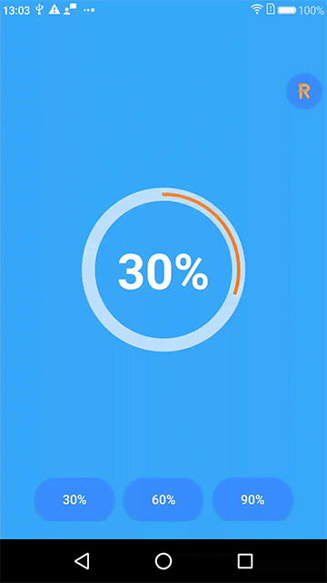

[](https://github.com/yinhaide/Rocket-master/wiki)
[](https://github.com/yinhaide/Rocket-master/wiki)
[](https://www.apache.org/licenses/LICENSE-2.0)

# HDCircleProgress
一个非常轻量级别的圆环进度控件，支持渐变色以及自定义属性



## 特性
+ **支持动画过度**

+ **支持设置背景色，圆环渐变色**

+ **支持设置动画持续时间**

+ **支持设置进度开始点**

+ **支持设置进度值**

## 如何快速集成

### 导入方式
在工程级别的**build.gradle**添加
```
allprojects {
    repositories {
        ...
        maven { url 'https://jitpack.io' }
    }
}
```
在应用级别的**build.gradle**添加
```
api 'com.github.yinhaide:HDCircleProgress:0.0.1'
```

## 范例
> 注意点:如果要设置渐变色的画注意其实颜色与结束颜色要保持一致
```
[XML]
    <com.yhd.circleprogress.CircleProgressView
        android:id="@+id/cpb"
        android:layout_width="match_parent"
        android:layout_height="match_parent"
        app:cr_animationTime="2000"
        app:cr_behindColor="#aaffffff"
        app:cr_progress="0.5"
        app:cr_progressWidthRatio="0.02"
        app:cr_widthRatio="0.08"
        app:cr_rotateAngle="-90"
        app:cr_progressColor="#FF8247,#FF7256,#CDAD00,#FF7256,#FF8247"/>

[JAVA] 
    circleProgressView.setProgress(0.5f);
```

## 分享设计思路
> 控件整体由两个圆环组成的，只是内圆环半径要小一些而且刚好在大圆环的居中位置
+ 第一步：绘制外边大圆环
+ 第二步：绘制中间小的进度圆环
+ 第三部：调节进度圆环的起始角度，持续角度等参数

## 这个项目会持续更新中... 
> 都看到这里了，如果觉得写的可以或者对你有帮助的话，顺手给个星星点下Star~

这个控件内部采用一个Fragment框架，如果有兴趣的话可以去了解一下
+ https://github.com/yinhaide/Rocket-master

## 关于我
+ **Email:** [123302687@qq.com](123302687@qq.com)
+ **Github:** [https://github.com/yinhaide](https://github.com/yinhaide)
+ **简书:** [https://www.jianshu.com/u/33c3dd2ceaa3](https://www.jianshu.com/u/33c3dd2ceaa3)
+ **CSDN:** [https://blog.csdn.net/yinhaide](https://blog.csdn.net/yinhaide)

## LICENSE
````
Copyright 2019 haide.yin(123302687@qq.com)

Licensed under the Apache License, Version 2.0 (the "License");
you may not use this file except in compliance with the License.
You may obtain a copy of the License at

    http://www.apache.org/licenses/LICENSE-2.0

Unless required by applicable law or agreed to in writing, software
distributed under the License is distributed on an "AS IS" BASIS,
WITHOUT WARRANTIES OR CONDITIONS OF ANY KIND, either express or implied.
See the License for the specific language governing permissions and
limitations under the License.
````